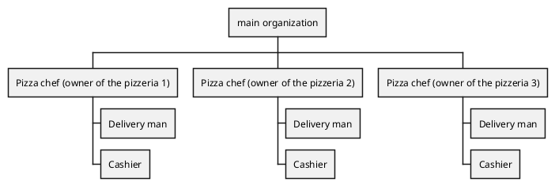

Model of Organization – as is

# Identification

Pizzeria Giusti, Nichelino (TO)

xxxxxxxxx (ex partita iva, codice fiscale, ..)

56.10.20

# Financial and legal information

Legal form (ex srl, snc, sas, plc, co, …)

Turn over year 2018
about 350.000€

# Organizational variables

## Size

3 employees full time (pizza chef)
3 employees full time (delivery man/cashier)
6 employees part time 50% (delivery man)
6 employees part time 10% ("jolly" delivery man)

3+1,5+3+0,6 = 8,1

8,1 FTE, year 2018

## Products, services

Pizzeria take away and delivery.

## Goal, goal type, mission, vision, strategy

### Goal

Italian pizza at good price and fast delivery

### strategy

#### Porter 

|        | Low cost | Uniqueness |
| ------ | -------- | ---------- |
| wide   | X        |            |
| narrow |          |            |

Strategy: low cost and fast delivery

## Culture

### Assumptions
 
 - "We always did it like this and it always worked"
 - "Not big deal if we can not deliver the right product (pizza)"
 - "It's better to have less employees than needed offering a low quality service/product than hiring more employees"
 - "to pay employees as few as possible"
 - "It's better to be unable to offer some products than stocking raw materials risking to waste money"

## Structure

Organizational chart

It is important to notice that the three pizzerias have no mechanism or office dedicated to horizontal communication, instead the owners use phone calls to communicate if something is out of stock in one of the branches to get it from one of the other two, so no information is stored about it. Accounting is done by counting the money by hand at the end of the day by the product owner.

### Type of structure

**Geografical**

Every function is replicated in all pizzerias: Management (done by the owners), accounting (done by the owner), manufactoring (pizza chef), marketing (deliverer also distributes advertisement letters), customer service (getting orders, done by the cashier).

### IT/IS  group / office

There is no IT/IS office.
The IT part of this organization is an external online food order service (just eat).

The activities for inventory and stuff like that are managed by the pizza chef (on paper) 

estimation of expense in IT/IS:
just eat fees = about 20%  
just eat ratio = just eat orders/tot orders = about 25%  
expense in IT (fees)= just eat fees * just eat ratio * turnover = 0,20 * 0,25 * 350000 = 17500 € per year  

num working days in a year = about 330 days  
Person hours for IT/IS per working day = about 6 hours (considering order management and inventory)  
Salary [€/hours] = 7€/hours  
expense in IT (employees) = Salary * person hours per working day * num working days in a year = 7 * 6 * 330 = 13860€ per year  
Report ratio: expense in IT / Turn over

## Formalization / specialization/ centralization

TODO:

**Specialization:** most of the task can be performed by every employee but some specific tasks like cooking pizzas require specific skills so can be performed only by a sub-group of employees (the owners)

**Centralization:** There is no centralization since all of the branches have their owner that has complete freedom over the management of their branch.

## Organizational type

Argument if organization is: mechanical / learning

Argument if organization is: entrepreneurial start up / divisionalized bureaucracy / etc

# Business Model Canvas

TODO:

Remark: key processes box must be consistent with IS Views /  Process view (below)

# IS Views

TODO:
## Functional view, data

TODO:

UML class diagram for data conceptual model (common to all processes / all organization)

## Functional view, processes

List and describe key processes

TODO:

| Process name                  | Description (text) | Input | Output |
| ----------------------------- | ------------------ | ----- | ------ |
| Inventory / restock           |                    |       |        |
| Get new order                 |                    |       |        |
| Prepare products for an order |                    |       |        |
| Deliver order                 |                    |       |        |

(must be consistent with key processes box in BMC)

(corresponds to &#39;Process identification&#39; step, see chapter &#39;Process redesign&#39; in lessons )

For processes that will be changed in the transition to To Be report BPMN model

### BPMN

TODO:
#### Invetory restock

TODO:
#### Get new order

TODO:
#### Prepare products for an order

TODO:
## IT  view

TODO:
### Application portfolio

TODO:

List IT applications or services used

| Application name | Vendor (or internal if made internally) | Main functions |
| ---------------- | --------------------------------------- | -------------- |
|                  |                                         |                |

### Technological view

TODO:

UML deployment diagram, showing computational nodes, and allocation of applications + data clusters to nodes

(data clusters == group of classes, from the data model, UML class diagram)

(applications are the ones identified in application portfolio)

### Outsourcing

TODO:

Highlight which IT service is outsourced (if any)

# IT strategy

TODO:

Summarize the current IT strategy, discuss if it is consistent with the company strategy

# Indicators

TODO:

## CSF

CSF ( derived by us)

general
C1 minimize the delivery time of the customer orders
C2 customer relationship 

Function (manufacturing)
CM1 Speed of order preparation (related to C1)

Function (marketing)
CF1 Order info management (related to C1 and C2)

TODO:

| CSF ID | Type (domain, distinguishing, environment, contingency) | Textual description, link to strategy | Related Metric(s) | Current value (if available) |
| ------ | ------------------------------------------------------- | ------------------------------------- | ----------------- | ---------------------------- |
| CSF1   |                                                         |                                       |                   |                              |
|        |                                                         |                                       |                   |                              |
|        |                                                         |                                       |                   |                              |

## KPI

TODO:
### Process X

(Process name must be consistent with IS view / Process view)

KPI table for process X

| KPI name | KPI type (general, service..) | description | Unit of measure | CSF covered (if any) | Current value (if available) |
| -------- | ----------------------------- | ----------- | --------------- | -------------------- | ---------------------------- |
|          |                               |             |                 |                      |                              |

### Process Y

To be repeated for each relevant process (notably processes that will be changed in To Be)

# Summary analysis

TODO:

Critical points in the organization and their possible interaction with IS.

IT alignment problems.