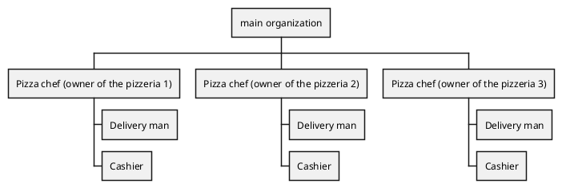
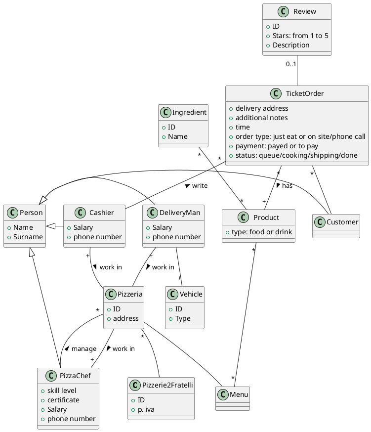
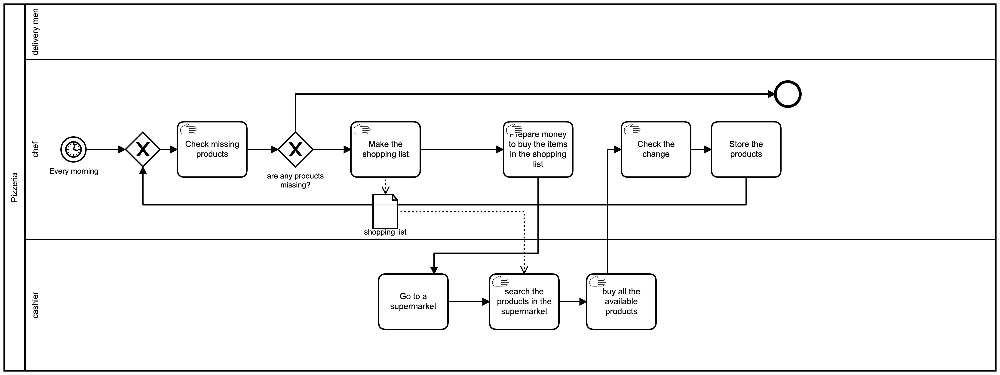
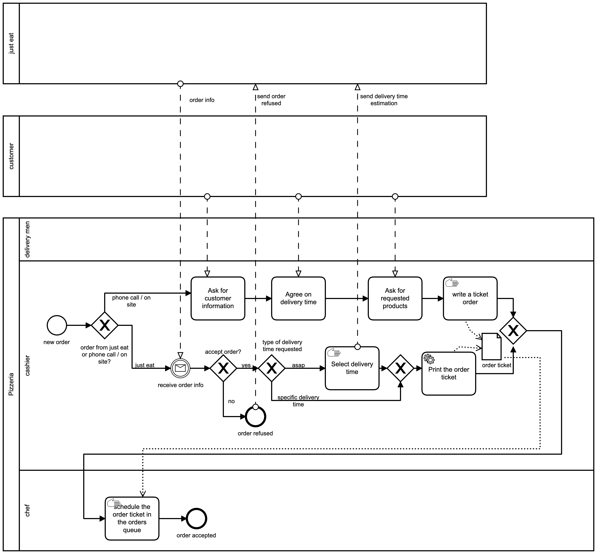
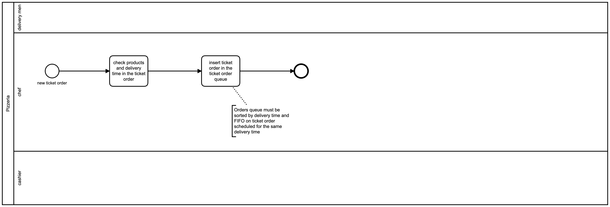
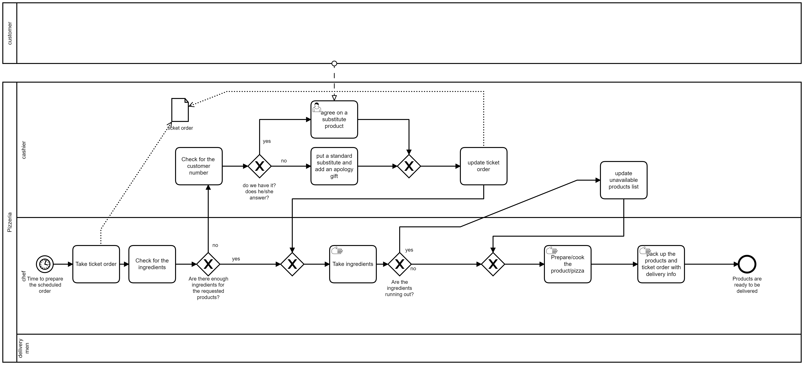
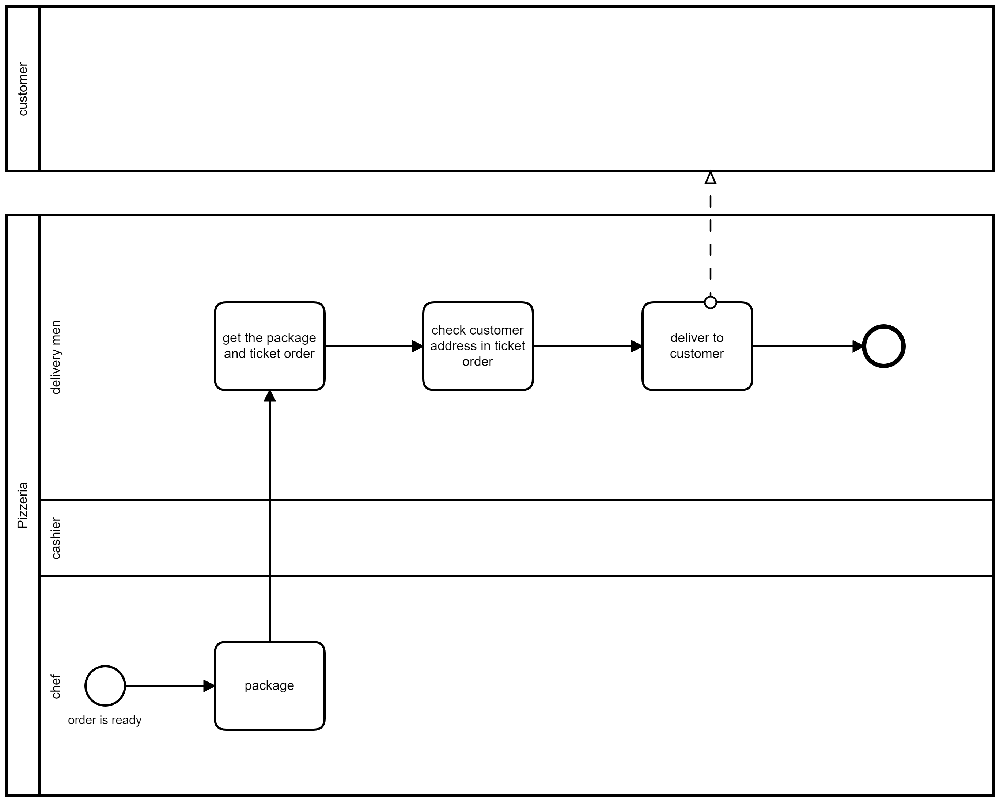
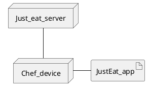

Model of Organization – as is

# Identification

Pizzerie 2 fratelli, Torino 
(3 pizzerias manged by 2 brothers)

xxxxxxxxx (ex partita iva, codice fiscale, ..)

56.10.20

# Financial and legal information

Legal form (ex srl, snc, sas, plc, co, …)

Turn over year 2018
about 350.000€ per pizzeria
about 1.050.000€ of all the pizzerias 

# Organizational variables

## Size

3 employees full time (pizza chefs and owners of the company) = 3 FTE
3 employees full time (delivery man/cashier) = 3 FTE
6 employees part time 50% (delivery man) = 3 FTE
6 employees part time 10% ("jolly" delivery man) = 0,6 FTE

3+3+3+0,6 = 9,6

9,6 FTE, year 2018

## Products, services

Pizzeria take away and delivery.

## Goal, goal type, mission, vision, strategy

### Goal

Italian pizza at good price and fast delivery

### strategy

#### Porter 

|        | Low cost | Uniqueness |
| ------ | -------- | ---------- |
| wide   | X        |            |
| narrow |          |            |

Strategy: low cost and fast delivery

## Culture

### Assumptions
 
 - "We always did it like this and it always worked"
 - "Not big deal if we can not deliver the right product (pizza)"
 - "It's better to have less employees than needed offering a low quality service/product than hiring more employees"
 - "to pay employees as few as possible"
 - "It's better to be unable to offer some products than stocking raw materials risking to waste money"

## Structure

Organizational chart

It is important to notice that the three pizzerias have no mechanism or office dedicated to horizontal communication, instead the owners use phone calls to communicate if something is out of stock in one of the branches to get it from one of the other two, so no information is stored about it. Accounting is done by counting the money by hand at the end of the day by the product owner.

### Type of structure

**Geografical**

Every function is replicated in all pizzerias: Management (done by the owners), accounting (done by the owner), manufactoring (pizza chef), marketing (deliverer also distributes advertisement letters), customer service (getting orders, done by the cashier).

### IT/IS  group / office

There is no IT/IS office.
The IT part of this organization is an external online food order service (just eat).

The activities for inventory, accounting and restock are managed by the pizza chef (producing only handwritten notes on paper) 

estimation of expense in IS:

just eat paper = 7,5€/month * 3 = 270€ per year 
ticket order post-it + pens = 10€/month * 3 = 360€ per year 
expense IS (paper) = 360+270 = 630€ 
num working days in a year = about 330 days
Average Person hours for IS per working day = about 6 hours per pizzeria (considering order management and inventory) * 3 pizzerias = 18
Salary [€/hours] = 7€/hours
expense in IS (employees) = Salary * person hours per working day * num working days in a year = 7 * 18 * 330 = 41580€ per year  
expense in IS (Total) = expense in IS (employees) + expense IS (paper) =  41580€ + 630€ = 42210€
**expense in IS (Total) = 42210€** 
**Report ratio: expense in IS / Turn over = 42210/1050000 = 0,0402**

### Other expenses (just eat fees)

just eat fees = about 14%  
just eat ratio = just eat orders/tot orders = 0,25  
expense in IS (fees)= just eat fees * just eat ratio * turnover = 0,14 * 0,25 * 1.050.000 = 36750 € per year  

## Formalization / specialization/ centralization

**Formalization:** low level of formalization, there aren't any specific standards or documents for this kind of activity (except for HACCP procedures)

**Specialization:** most of the task can be performed by every employee but some specific tasks like cooking pizzas require specific skills so can be performed only by a sub-group of employees (the owners)

**Centralization:** There is no centralization since all of the branches have their owner that has complete freedom over the management of their branch.

## Organizational type

The *Pizzeria due fratelli* organization is an entrepreneurial start up with a very low level of formalization (problems are handled on the fly without standard procedures) and a primitive hierarchical structure (all decisional power is in the hand of the owners)

# Business Model Canvas

<table class="tg">
<tbody>
  <tr>
    <td class="tg-0pky" rowspan="2">Key partnerships - Flour, vegetabe and meat suppliers. - JustEat</td>
    <td class="tg-0pky">Key activities Manufactoring (producing pizzas)  Logistic (Delivering)</td>
    <td class="tg-0pky" rowspan="2">Value Proposition Low-cost italian pizza at home with a reliable and fast delivery service   (serving only orders within a certain range from the three restaurants)    'Order and forget, relax'</td>
    <td class="tg-0pky">Customer Relationship  self service (call restaurant if there is problem) </td>
    <td class="tg-0pky" rowspan="2">Customers segments People used to eat ordered pizza at home</td>
  </tr>
  <tr>
    <td class="tg-0pky">Key Resources - Restaurants - Inventory of Ingredients for pizza production - Inventory of drinks
     - Delivering Cars</td>
    <td class="tg-0pky">Channels Restaurants (face to face interaction customer-cashier), Phone lines advertised by paper flyers, food delivery application NOT managed by the company (JustEat)</td>
  </tr>
  <tr>
    <td class="tg-0pky" colspan="2">Cost Structure Restaurants, Employees, Ingredients, JustEat fees</td>
    <td class="tg-0pky" colspan="3">Revenue Streams Sales of pizzas and drinks</td>
  </tr>
</tbody>
</table>
Remark: key processes box must be consistent with IS Views /  Process view (below)

# IS Views

## Functional view, data

## Functional view, processes

| Process name            | Description (text)                                                               | Input                           | Output                                |
| ----------------------- | -------------------------------------------------------------------------------- | ------------------------------- | ------------------------------------- |
| **Inventory / restock** | Check the missing ingredients, buy them and restock theinventory                 | ingredients request             | inventory restocked                   |
| **Get new order**       | Customer requests products, all the informations are written in the order ticket | order request                   | order ticket                          |
| **Queue organization**  | Organize ticket orders in a sorted queue by delivery time                        | ticket order                    | ticket orders in an ordered queue     |
| **Prepare order**       | Cook products and pack up them in pizza boxes                                    | scheduled order                 | pizza ready to be delivered/picked up |
| **Deliver order**       | Get the products ready to be delivered and ship them to the customer             | Products ready and order ticket | Product at customers house            |

(must be consistent with key processes box in BMC)

(corresponds to Process 'identification' step, see chapter 'Process redesign' in lessons )

For processes that will be changed in the transition to To Be report BPMN model

### BPMN

#### Inventory restock

#### Get new order

#### Queue management

#### Prepare order

#### Delivery

## IT  view

### Application portfolio

| Application name     | Vendor (or internal if made internally) | Main functions         |
| -------------------- | --------------------------------------- | ---------------------- |
| Just eat application | just eat                                | manage just eat orders |

### Technological view

### Outsourcing

The service "JustEat" used to get orders is outsourced.

# IT strategy

There is no IT strategy except for the partnership with JustEat.

# Indicators

## CSF

CSF ( derived by us)

- CSF1 fast delivery time of the customer orders  
  - CSF11 response time to phone calls
  - CSF12 number of pizzas produced per week
  - CSF13 mean time to transport an order

- CSF2 quality of the product and service
  - CSF21 number of complaints from users
  - CSF22 ratings of reviews on JustEat

- CSF3 Marketing efficiency
  - CSF31 Number of new clients
  - CSF32 trend of sales
  - CSF33 delivered advertisement flyers

TODO:

| CSF ID | Type (domain, distinguishing, environment, contingency) | Textual description, link to strategy     | Related Metric(s)                                                                                                          | Current value (if available)                                              |
| ------ | ------------------------------------------------------- | ----------------------------------------- | -------------------------------------------------------------------------------------------------------------------------- | ------------------------------------------------------------------------- |
| CSF1   | Buisness domain                                         | fast delivery time of the customer orders | - Response time to phone calls and call duration  - mean time to prepare an order  - mean time to transport an order | - 2 min  -  **X** minutes  - 8  min                                 |
| CSF2   | Buisness domain                                         | quality of the product and service        | - complaints per week  -mean rating of JustEat reviews of last week                                                  | - **X** complaints/week  - **X** stars                                 |
| CSF3   | Buisness domain                                         | Marketing efficiency                      | - new clients per week    -sales per week -number of distributed flyers per week                                     | - **X** clients -**X** pizzas sold per week - **X** flyers per week |

## KPI

**Time domain: one week**
### Process 1: "Inventory Restock"

| KPI name                    | KPI type (general, service..) | description                                                                     | Unit of measure | CSF covered (if any) | Current value (if available) |
| --------------------------- | ----------------------------- | ------------------------------------------------------------------------------- | --------------- | -------------------- | ---------------------------- |
| Shopping time               | Service                       | time spent in buying missing ingredients from departure from pizzeria to return | Time            | -                    | -                            |
| shopping frequency          | General                       | Number of times shopping for missing product is needed                          | Count           | -                    | -                            |
| Ingredient Requests         | General                       | Number of time a product needs to be restocked                                  | Count           | -                    | -                            |
| Ingredient Bought           | General                       | Number of time a requested product is bought                                    | Count           | -                    | -                            |
| Restocked Ingredients Ratio | Quality                       | Ingredients bought/ingredient requested                                         | Number          | -                    | -                            |

### Process 2: "Get New Order"

| KPI name                   | KPI type (general, service..) | description                                               | Unit of measure | CSF covered (if any) | Current value (if available) |
| -------------------------- | ----------------------------- | --------------------------------------------------------- | --------------- | -------------------- | ---------------------------- |
| Order quantity             | General                       | Number of orders received                                 | Count           | CSF3                 | -                            |
| Wrong Order quantity       | General                       | Number of orders signed wrong                             | Count           | CSF2                 | -                            |
| Odered Products            | General                       | Number of products ordered                                | Count           | CSF3                 | -                            |
| Time to order              | Service                       | Time spent getting orders infos                           | Time            | CSF1                 | -                            |
| UC received order          | Efficiency                    | (Cashiers salary + postit cost)/Number of received orders | Euro            | -                    | -                            |
| Number of telephone orders | General                       | Number of orders received by telephone call               | Count           | -                    | -                            |
| Number of JustEat orders   | General                       | Number of orders received via JustEat                     | Count           | -                    | -                            |

### Process 3: "Queue managment"

| KPI name          | KPI type (general, service..) | description                                      | Unit of measure | CSF covered (if any) | Current value (if available) |
| ----------------- | ----------------------------- | ------------------------------------------------ | --------------- | -------------------- | ---------------------------- |
| Ticket Input      | General                       | Ticket handed from the cashier to the pizza chef | Count           | -                    | -                            |
| Ticket Output     | General                       | Ticket processed from the pizza chef             | Count           | -                    | -                            |
| Ticket loss ratio | Quality                       | 1 - (Ticket Output/Ticket Input)                 | Number          | CSF2                 | -                            |

### Process 4: "Prepare order"

| KPI name                       | KPI type (general, service..) | description                                                              | Unit of measure | CSF covered (if any) | Current value (if available) |
| ------------------------------ | ----------------------------- | ------------------------------------------------------------------------ | --------------- | -------------------- | ---------------------------- |
| NPOFMI                         | General                       | Non Preparable Orders For Missing Ingredients                            | Count           | CSF2                 | -                            |
| Number of NPOFMI order changed | General                       | Number of product substitution agreed with customer                      | Count           | CSF2                 | -                            |
| Wrong orders ratio             | Quality                       | 1 - (Number of orders changed/NPOFMI)                                    | Number          | CSF2                 | -                            |
| Pizzas per order               | General                       | Average number of pizzas in one order                                    | Number          | -                    | -                            |
| Time to cook one order         | Service                       | Average time to cook one order                                           | Time            | CSF2                 | -                            |
| UC Order                       | Efficiency                    | (Infrastructure cost + Ingredients + Pizza Chef salary)/Number of orders | Euro            |                      | -                            |

### Process 5: "Delivery"

| KPI name             | KPI type (general, service..) | description                                                                    | Unit of measure | CSF covered (if any) | Current value (if available) |
| -------------------- | ----------------------------- | ------------------------------------------------------------------------------ | --------------- | -------------------- | ---------------------------- |
| LT to deliver        | Service                       | Time from order handed to the deliverer to order handed to the customer        | Time            | CSF1                 | -                            |
| Orders delivered     | Service                       | Number of orders succesfully delivered to the customers                        | Count           | -                    | -                            |
| Orders non delivered | Service                       | Number of orders unsuccesfully delivered to the customers                      | Count           | -                    | -                            |
| Delivery Loss ratio  | Quality                       | Orders non delivered/(Orders delivered + orders non delivered)                 | Number          | CSF2                 | -                            |
| Punctuality          | Service                       | Actual delivery time/estimated delivery time                                   | Number          | CSF2, CSF1           | -                            |
| UC Delivery          | Efficiency                    | (Salary of all delivery employee + delivery cars maintenance)/Orders delivered | Euro            | -                    | -                            |
| Distributed Flyers   | General                       | Number of distributed flyers                                                   | Count           | CSF3                 | -                            |
# Summary analysis

Critical points in the organization and their possible interaction with IS.

- Hand management of post-it orders ticket in the kitchen by the pizza chef leads to two problems: wrong hand-sorting of orders by time (leading to latency in the production of an order) and physical loss of post-its in the messy environment of the kitchen (leading to complete loss of orders or loss of customer address, needed for the order delivery).
- Absence of a way to keep track of the ingredients storage levels leads to the cashier accepting also orders that cannot be satisfied due to lack of the needed ingredients, causing customer unsatisfaction, damage of reputation and money loss.

IT system is basically absent except for the just eat account.
