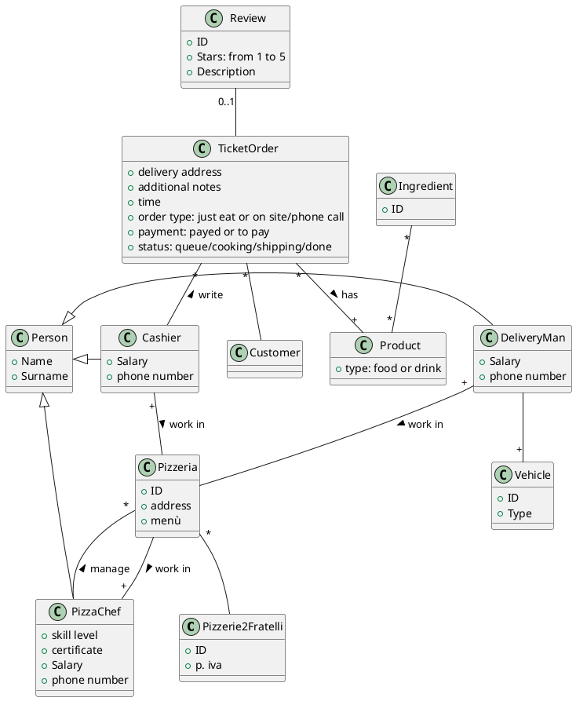
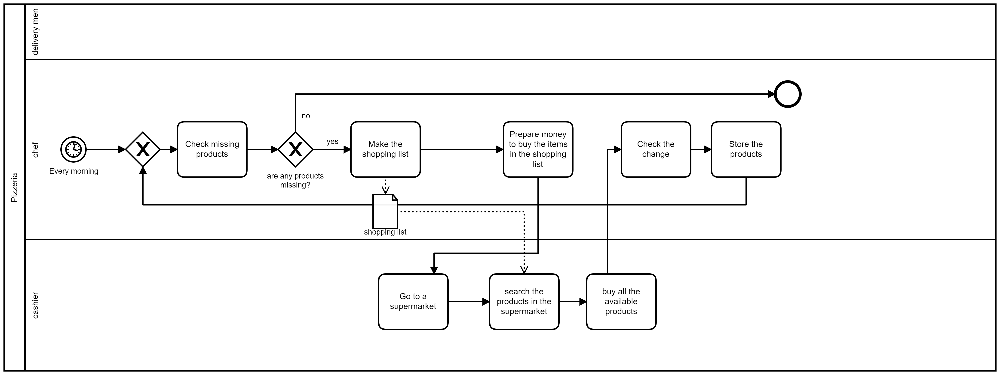
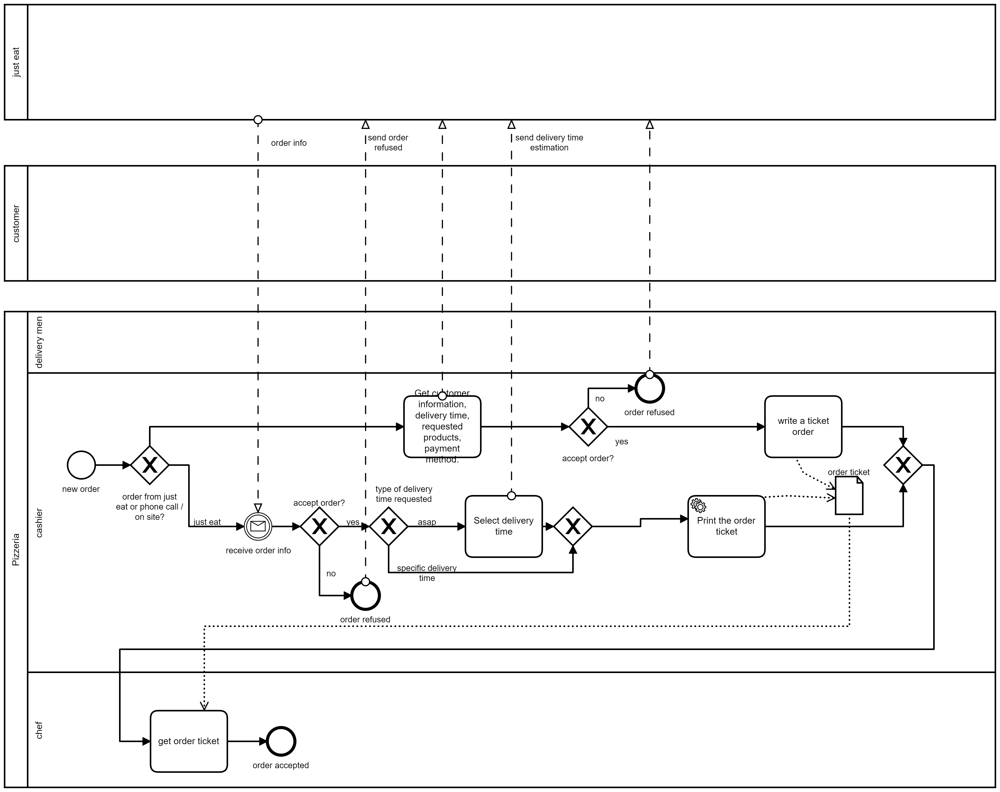
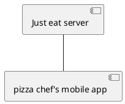

Model of Organization – as is

# Identification

Pizzerie 2 fratelli, Torino 
(3 pizzerias manged by 2 brothers)

xxxxxxxxx (ex partita iva, codice fiscale, ..)

56.10.20

# Financial and legal information

Legal form (ex srl, snc, sas, plc, co, …)

Turn over year 2018
about 350.000€ per pizzeria
about 1.050.000€ of all the pizzerias 

# Organizational variables

## Size

3 employees full time (pizza chefs and owners of the company)
3 employees full time (delivery man/cashier)
6 employees part time 50% (delivery man)
6 employees part time 10% ("jolly" delivery man)

3+1,5+3+0,6 = 8,1

8,1 FTE, year 2018

## Products, services

Pizzeria take away and delivery.

## Goal, goal type, mission, vision, strategy

### Goal

Italian pizza at good price and fast delivery

### strategy

#### Porter 

|        | Low cost | Uniqueness |
| ------ | -------- | ---------- |
| wide   | X        |            |
| narrow |          |            |

Strategy: low cost and fast delivery

## Culture

### Assumptions
 
 - "We always did it like this and it always worked"
 - "Not big deal if we can not deliver the right product (pizza)"
 - "It's better to have less employees than needed offering a low quality service/product than hiring more employees"
 - "to pay employees as few as possible"
 - "It's better to be unable to offer some products than stocking raw materials risking to waste money"

## Structure

Organizational chart

It is important to notice that the three pizzerias have no mechanism or office dedicated to horizontal communication, instead the owners use phone calls to communicate if something is out of stock in one of the branches to get it from one of the other two, so no information is stored about it. Accounting is done by counting the money by hand at the end of the day by the product owner.

### Type of structure

**Geografical**

Every function is replicated in all pizzerias: Management (done by the owners), accounting (done by the owner), manufactoring (pizza chef), marketing (deliverer also distributes advertisement letters), customer service (getting orders, done by the cashier).

### IT/IS  group / office

There is no IT/IS office.
The IT part of this organization is an external online food order service (just eat).

The activities for inventory, accounting and restock are managed by the pizza chef (producing only handwritten notes on paper) 

estimation of expense in IT/IS:
just eat fees = about 14%  
just eat ratio = just eat orders/tot orders = about 14%  
expense in IT (fees)= just eat fees * just eat ratio * turnover = 0,14 * 0,25 * 1.050.000 = 36750 € per year  
just eat paper = 7,5€/month * 3 = 270€ per year 
ticket order post-it + pens = 10€/month * 3 = 360€ per year 
expense IT (paper) = 360+270 = 630€ 
num working days in a year = about 330 days
Average Person hours for IT/IS per working day = about 6 hours per pizzeria (considering order management and inventory) * 3 pizzerias = 18
Salary [€/hours] = 7€/hours
expense in IT (employees) = Salary * person hours per working day * num working days in a year = 7 * 18 * 330 = 41580€ per year  
expense in IT (Total) = expense in IT (employees) + expense in IT (fees) + expense IT (paper) = 52500€ + 41580€ + 630€ = 94710€
**expense in IT (Total) = 94710€** 
**Report ratio: expense in IT / Turn over = 94710/1050000 = 0,0902**

## Formalization / specialization/ centralization

**Formalization:** low level of formalization, there aren't any specific standards or documents for this kind of activity (except for HACCP procedures)

**Specialization:** most of the task can be performed by every employee but some specific tasks like cooking pizzas require specific skills so can be performed only by a sub-group of employees (the owners)

**Centralization:** There is no centralization since all of the branches have their owner that has complete freedom over the management of their branch.

## Organizational type

Argument if organization is: mechanical / learning

Argument if organization is: entrepreneurial start up / divisionalized bureaucracy / etc

# Business Model Canvas

<table class="tg">
<tbody>
  <tr>
    <td class="tg-0pky" rowspan="2">Key partnerships - Flour, vegetabe and meat suppliers. - JustEat</td>
    <td class="tg-0pky">Key activities Manufactoring (producing pizzas)  Logistic (Delivering)</td>
    <td class="tg-0pky" rowspan="2">Value Proposition Low-cost italian pizza at home with a reliable and fast delivery service   (serving only orders within a certain range from the three restaurants)    'Order and forget, relax'</td>
    <td class="tg-0pky">Customer Relationship  self service (call restaurant if there is problem) </td>
    <td class="tg-0pky" rowspan="2">Customers segments People used to eat ordered pizza at home</td>
  </tr>
  <tr>
    <td class="tg-0pky">Key Resources - Restaurants - Inventory of Ingredients for pizza production - Inventory of drinks
     - Delivering Cars</td>
    <td class="tg-0pky">Channels Restaurants (face to face interaction customer-cashier), Phone lines advertised by paper flyers, food delivery application NOT managed by the company (JustEat)</td>
  </tr>
  <tr>
    <td class="tg-0pky" colspan="2">Cost Structure Restaurants, Employees, Ingredients, JustEat fees</td>
    <td class="tg-0pky" colspan="3">Revenue Streams Sales of pizzas and drinks</td>
  </tr>
</tbody>
</table>
Remark: key processes box must be consistent with IS Views /  Process view (below)

# IS Views

## Functional view, data

## Functional view, processes

List and describe key processes

| Process name                      | Description (text)                                                               | Input                           | Output                                |
| --------------------------------- | -------------------------------------------------------------------------------- | ------------------------------- | ------------------------------------- |
| **Inventory / restock**           | Check the missing ingredients, buy them and restock theinventory                 | ingredients request             | inventory restocked                   |
| **Get new order**                 | Customer requests products, all the informations are written in the order ticket | order request                   | order ticket                          |
| **Queue organization**            | Organize ticket orders in a sorted queue by delivery time                        | ticket order                    | ticket orders in an ordered queue     |
| **Prepare products for an order** | Cook products and pack up them in pizza boxes                                    | scheduled order                 | pizza ready to be delivered/picked up |
| Deliver order                     | Get the products ready to be delivered and ship them to the customer             | Products ready and order ticket | Product at customers house            |

(must be consistent with key processes box in BMC)

(corresponds to Process 'identification' step, see chapter 'Process redesign' in lessons )

For processes that will be changed in the transition to To Be report BPMN model

### BPMN

#### Invetory restock

#### Get new order

#### Queue management

#### Prepare products for an order

## IT  view

### Application portfolio

List IT applications or services used

| Application name     | Vendor (or internal if made internally) | Main functions         |
| -------------------- | --------------------------------------- | ---------------------- |
| Just eat application | just eat                                | manage just eat orders |

### Technological view

UML deployment diagram, showing computational nodes, and allocation of applications + data clusters to nodes

(data clusters == group of classes, from the data model, UML class diagram)

(applications are the ones identified in application portfolio)

### Outsourcing

TODO:

Highlight which IT service is outsourced (if any)

# IT strategy

TODO:

Summarize the current IT strategy, discuss if it is consistent with the company strategy

# Indicators

TODO:

## CSF

CSF ( derived by us)

- CSF1 fast delivery time of the customer orders  
  - CSF11 response time to phone calls
  - CSF12 number of pizzas produced per week
  - CSF13 mean time to transport an order

- CSF2 quality of the product and service
  - CSF21 number of complaints from users
  - CSF22 ratings of reviews on JustEat

- CSF3 Marketing efficiency
  - CSF31 Number of new clients
  - CSF32 trend of sales
  - CSF33 delivered advertisement flyers

TODO:

| CSF ID | Type (domain, distinguishing, environment, contingency) | Textual description, link to strategy     | Related Metric(s)                                                                                             | Current value (if available)                                              |
| ------ | ------------------------------------------------------- | ----------------------------------------- | ------------------------------------------------------------------------------------------------------------- | ------------------------------------------------------------------------- |
| CSF1   | Buisness domain                                         | fast delivery time of the customer orders | - Response time to phone calls  - number of pizzas produced per week  - mean time to transport an order | - 2 min  -  **X** pizza/week - 8  min                               |
| CSF2   | Buisness domain                                         | quality of the product                    | - complaints per week  -mean rating of JustEat reviews of last week                                     | - **X** complaints/week  - **X** stars                                 |
| CSF3   | Buisness domain                                         | Marketing efficiency                      | - new clients per week    -sales per week -number of distributed flyers per week                        | - **X** clients -**X** pizzas sold per week - **X** flyers per week |

## KPI

TODO:
### Process X

(Process name must be consistent with IS view / Process view)

KPI table for process X

| KPI name | KPI type (general, service..) | description | Unit of measure | CSF covered (if any) | Current value (if available) |
| -------- | ----------------------------- | ----------- | --------------- | -------------------- | ---------------------------- |
|          |                               |             |                 |                      |                              |

### Process Y

To be repeated for each relevant process (notably processes that will be changed in To Be)

# Summary analysis

TODO:

Critical points in the organization and their possible interaction with IS.

IT alignment problems.