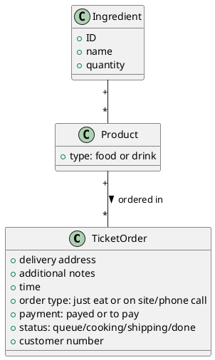
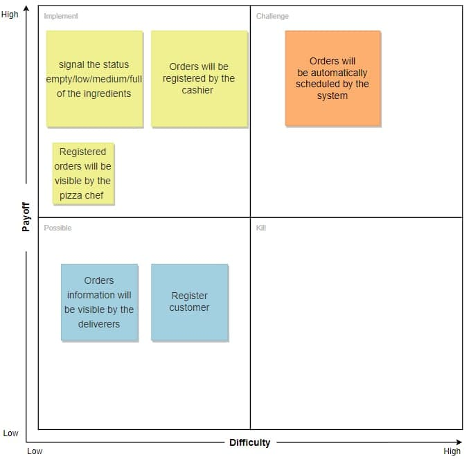
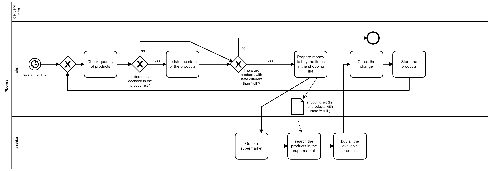
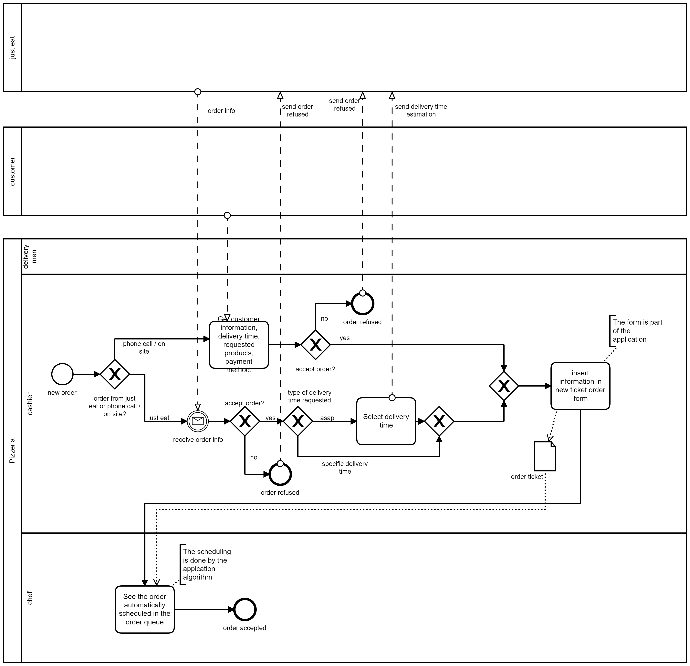
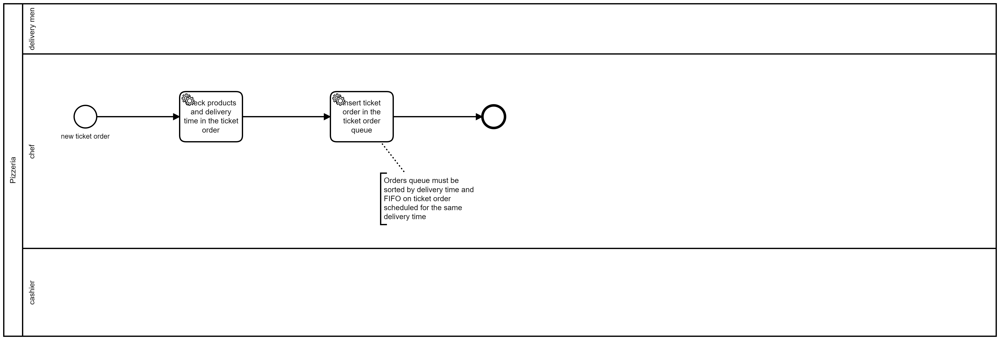
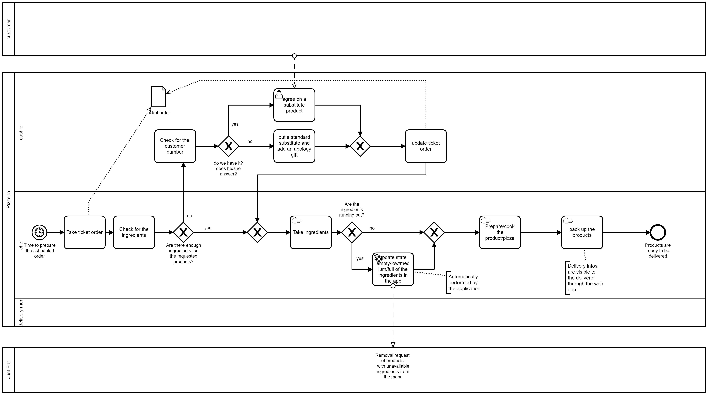
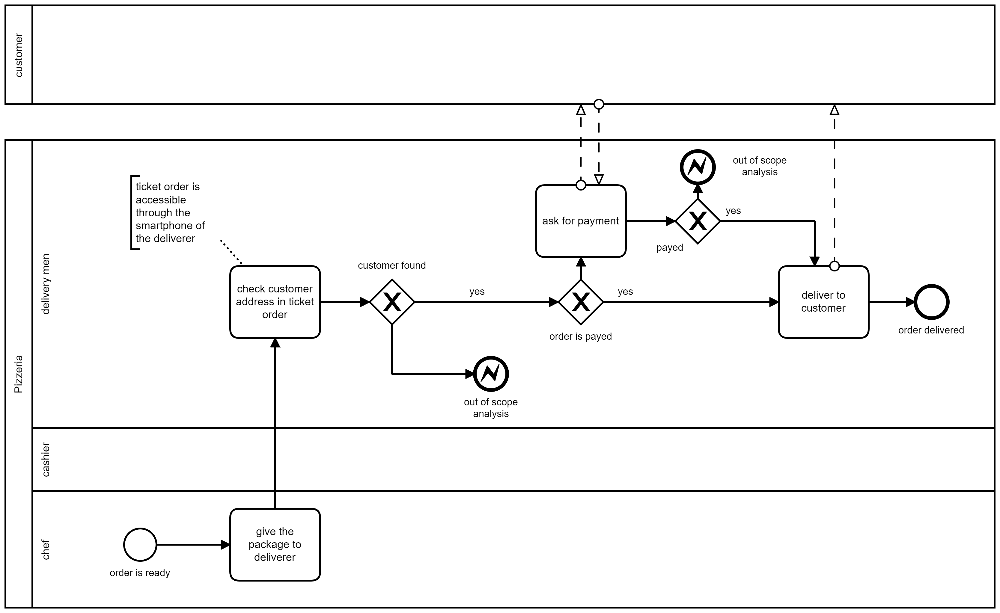

Model of Organization: To Be

# Summary of changes

Here describe at high level the change(s), and their motivation. Link with critical points identified in As Is analysis

**To contrast order loss and mischeduling of orders**
A web app will be developed to automatize and reduce human errors in the following events:
- A section of the web applications will be used by the pizza chef to signal the status empty/low/medium/full of the ingredients, this will be useful for:
  - Giving the cashier the ability to register only orders that can be satisfied reaching an agreement with the client at ordering time.
  - Automatically create a shopping list for the restock. 
- Orders will be registered by the cashier in the system with a dedicated form instead of writing the infos by hand on paper post-its.
- Registered orders will be visible by the pizza chef in the kitchen and automatically scheduled by the system 
- Orders information will be visible by the deliverers in a dedicated page of the webapp through their smartphones.
- Register customer to get customer informations only once in order to:
  - build loyalty of the customer by offering loyalty prizes.
  - speed up ordering process

# Organizational variables

Keep this section and subsections, if there is no change just write 'no change'.  In case there is a change detail it.

## Size
No change

## Products services
No change
## Goal, goal type, vision, mission, strategy
No change
## Culture
- "striving for customer satisfaction"
## Structure
No change
### IT office
Outsourced management of the application and technical assistance by IT consultancy company
## Formalization specialization centralization
No change
## Organizational type
No change
# Business model canvas

Boxes that change:

**Key Partnership:**
- Added to the key partners the consultancy company that produces and maintain the web app

**Cost structure**
- Added to the cost structue the maintenance of the web app

**Key Resources**
- Added to the Key Resources the web app

# IS Views

## Functional view, data

Ticket order now have an additional field: customer number

Quantity in Ingredient (empty low  medium full)

## Functional view, processes

No change

### Process selection

#### Inventory restock

- The shopping list is easier to do than in the ASIS scenario since the state of the product is continuously updated during working time
- The shopping list can be produced automatically by the system.
#### Get new order

- Order is no more registered through a post it but instead is inserted in a form, leaving less space to human error (forgetting to ask for something) in getting the infos 
- The order can be composed only with products formed by ingredients that are available.
- A created order becomes now visible to the pizza chef automatically from a dedicated screen in the kitchen 
- Orders not being physical beings are now immune to loss or damage.
#### Queue management

- Differently from the ASIS scenario, this is completely automatized by the system.
#### Prepare order

- since the system knows what products are produced with each ingredient, the chef can signal through a dedicated interface the unavailability of certain ingredients and the system will automatically compute the unavailability of the products communicating to Just Eat and the cashier interface.
- the order can be changed by the cashier through the interface.

#### Delivery

- the deliverer is less prone to lose ticket orders since are accessible via a dedicated section of the webapp, through their smartphone.

For each changed process report the new BPMN (highlight where are the changes and why) and  the software functions needed by the IS, as follows

| Activity in BPMN                                | Supporting Software functions                                                                                        |
| ----------------------------------------------- | -------------------------------------------------------------------------------------------------------------------- |
| Register a ticket order                         | - show new ticket order form   - create new ticket order object                                                   |
| Show orders                                     | - get orders   - print order list   -show order details                                                        |
| Update order                                    | - setters for ticket order objects                                                                                   |
| Schedule orders                                 | - Priority queue list of ticket orders   - compute order priority by delivery time and estimated preparation time |
| Update ingredients availability                 | - setters for Ingredients                                                                                            |
| Show shopping list                              | - get list of orders with state different from "full"                                                                |
| Request product availability update in just eat | - Request to set product available/unavailable to Just Eat                                                           |
| Show order delivery info                        | - Get order delivery info                                                                                            |

## IT view

### Application portfolio

No change

#### Selection

Describe the applications considered for the selection

| Application name             | Vendor    | Description                                                        | Price model and fees |
| ---------------------------- | --------- | ------------------------------------------------------------------ | -------------------- |
| SirioTrade                   | COMPASS   | Manages only accounting, orders at the table and menu composition. | fixed price          |
| Simphony POS for Restaurants | ORACLE    | Manages everything                                                 | time and material    |
| OpenBravo                    | OPENBRAVO | Manages everything                                                 | time and material    |

Describe here how the selection of the new application was made

| Criterion                 | SirioTrade | Simphony POS for Restaurants | OpenBravo |
| ------------------------- | ---------- | ---------------------------- | --------- |
| Inventory Management      |            | x                            | x         |
| Kitchen / Menu Management | x          | x                            | x         |
| Point of Sale (POS)       | x          | x                            | x         |
| Order List Management     |            | x                            |           |

**A custom made application is needed.** This conclusion is reached through the analysis of the competitors proposals. even though Simphony POS would cover all of our needs it would also mean for the pizzerias to buy IT hardware that supports it from ORACLE and this may be an high money investment where the value is represented by the access to a lot of functions (Financial analysis, cloud hosting of records, table service assistance, ...) that the activity doesn't need.
Its development will be outsourced to a consulting company with an *una tantum* payment estimated around 15k$ and a very low price of maintenance.

The Coverage below is evaluated considering oracle simphony

#### Coverage

Show how the selected application (Oracle simphony) provides the software functions needed (as identified in Functional view, processes section), discuss gaps, if any

| Software function needed (from process view) | Software function provided by application selected   | Gap analysis                                                                                              |
| -------------------------------------------- | ---------------------------------------------------- | --------------------------------------------------------------------------------------------------------- |
| Inventory Management                         | Inventory management                                 | It doesn't have an easy and fast gui for the chef to comunicate in run time when a product is running out |
| Kitchen / Menu Management                    | Invenctory Management / Menu management              | -                                                                                                         |
| POS                                          | Series workstation                                    | -                                                                                                         |
| Order List Management                        | Multi-channel visualization system for the kitchens | -                                                                                                         |

Note: if the price of oracle application is too high we can opt for a custom made application from an it consulting company, in this case the app should be able to provide every function we need with no gap

### Technological view

#### Integration

In case a new application is introduced discuss how integration happens in terms of

Data exchange (which data is exchanged)

Control mechanism (mechanism used by applications to interact, ex message passing, rpc, etc)

The custom made app PizzeriaManagementApp will be deployed in a cloud server rented, Employees will have their accounts and will be able to perform their tasks through a browser in their devices.

- Data exchange
  - Orders received and products availability communicated between cashiers and chefs through the web app 
  - Product availability communicated from chefs and just eat app through autmatic detection of unavailable products from pizzerias server to JustEat

- Control mechanism
  - PizzeriaManagementApp will communicate to JustEat with JustEat exposed APIs.

# IT strategy

The development and maintenance of the webapp will be outsourced to a consulence.
The hosting of the server will be outsourced to a cloud hosting provider by renting it.

# Effect of change(s)

## Effect on KPIs and CSFs

(remark, KPIs and CSFs should not depend on the change, but should remain the ones defined in the As Is section the goal being to compare the effect of the change on the same indicators)

Report only indicators that are supposed to change, argument on why the change has an effect on them, report how much the indicator could change. Do not forget the unit cost of the product / service.

| Indicator (Csf, Kpi) name                | Effect                                                                                                                                                                                                                                                        | Quantitative estimate of variation (absolute, %) |
| ---------------------------------------- | ------------------------------------------------------------------------------------------------------------------------------------------------------------------------------------------------------------------------------------------------------------- | ------------------------------------------------ |
| Wrong Order quantity                     | Form structure will provide error prevention and standardization of the ticket order                                                                                                                                                                          | -90%                                             |
| Time to order                            | Standardization of order structure will lead to less "thinking" speeding up the process                                                                                                                                                                       | -10%                                             |
| Ticket loss ratio                        | Digital ticket orders cannot be lost differenty from post/its                                                                                                                                                                                                 | -100%                                            |
| NPOFMI/Wrong orders ratio                | Automatic logical inference of unavailability of a certain product through the analysis of the ingredients level communicated from the chef will lead to an extreme diminuition of the Non Preparable Orders For Missing Ingredients                          | -90% / -80%                                      |
| Orders non delivered/Delivery loss ratio | Ticket order standardization will diminish ticket orders without customer information, ticket order lost by the deliverer becomes impossible, the remaining point of failure is the client giving wrong informations or the cashier inputting a wrong address | -80% / -50%                                      |
|                                          |                                                                                                                                                                                                                                                               |                                                  |

## TCO, ROI and Break even

In the following analysis we consider the custom made application

| Phsae          | Description                                                                          |
| -------------- | ------------------------------------------------------------------------------------ |
| Construction C | Cost for development/acquisition of the software application and the hardware needed |
| Deployment D   | Cost for deployment of software funcions and training of employees                   |
| Operation O    | Cost for the infrasructure operation (electricity)                                   |
| Dismissal DS   | Cost for uninstalling application and infrastructure dismissal                       |
| Gain  G        | Gain considering the acquisition of new clients because of the better reputation     |
| Saving S       | The saving money considering the upgrade of the IS (no paper post-it are needed)     |

Assuming:
| role         | num of employees | estimate training time |
| ------------ | ---------------- | ---------------------- |
| pizza chef   | 3                | 8h                     |
| cashier      | 3                | 8h                     |
| delivery man | 12               | 1h                     |
 total:                  8 * 3 + 8 * 3 + 1 * 12 = 60h 

 - Cost+D = cost of the application + estimate training time * salary = 15k€ + 60h * 7€/h = 15420 €
 - O + M = about 3k€
 - S = CostOfTicketOrderPostitPerYear
 - The reputation of the pizzerias can't be evalued in saving money but in can be evaluated in `number of gained fidelity customers` in the year $y$ :  "$C_y$" that will not be lost and new acquired customers
   - `estimated # lost fidelity customers in a year` : 10 (because of errors in the orders)
   - `estimated # new fidelity customers in a year y`: this is incremental because the reputation will increase over time (i.e: 15, 21, 30, 45, 60 )
   - `average gain from a single fidelity customer`: $C_€ = 10 €/month = 120€/year$
 - G =$ \sum_{n=1}^{y} C_n *C_€ $ 
   - The customer will 

|        | Year 1           | Year 2                | Year 3                    | Year 4                        | Year 5                           |
| ------ | ---------------- | --------------------- | ------------------------- | ----------------------------- | -------------------------------- |
| Cost   | Cost,D,O,M       | O,M                   | O,M                       | O,M                           | O,M                              |
| $C_y$  | 10+15=25         | 10+21=31              | 10+30=40                  | 10+45=55                      | 10+60=70                         |
| Saving | S                | S                     | S                         | S                             | S                                |
| Gain   | 25 * 120 = 3000€ | (31+25) * 120 = 6720€ | (25+31+40) * 120 = 11520€ | (25+31+40+55) * 120 =  18120€ | (25 +31+40+55+70) * 120 = 26520€ |
| Total  | -15060€          | -10980€               | -2100€                    | 13380€                        | 36900€                           |

if we consider the estimated gain from the new customers acquired thanks to the increase in reputation, **3 years are needed to recover the initial cost**
## Risks

The main risks are related to employees, they may not understand why the use of an IS is useful and they may not want to change their habits (especially for the older employees).
In order to encourage the employees the hours spent in training must be paid (in fact the training cost is considered in the deployment cost)

# Conclusion

The organization should change in this way in order to increase the reputation of the pizzerias. In this way the pizzeria can easly beat the competitors and acquire new customers.
The Chef can focus on the preparation of the products without thining about the order queue.
The Cashier will have a more organized work method to register orders and will have less complaints from not dissatisfied customers
