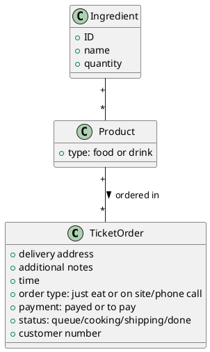

Model of Organization: To Be

# Summary of changes

Here describe at high level the change(s), and their motivation. Link with critical points identified in As Is analysis

**To contrast order loss and mischeduling of orders**
An existing restaurant-management product will be introduced to automatize and reduce human errors in the following events:
- The product should offer to the pizza chef a way to signal the status empty/low/medium/full of the ingredients, this will be useful for:
  - Giving the cashier the ability to register only orders that can be satisfied reaching an agreement with the client at ordering time.
  - Automatically create a shopping list for the restock. 
- Orders will be registered by the cashier in the system with an automatic and standardized input instead of writing the infos by hand on paper post-its.
- Registered orders should be visible by the pizza chef in the kitchen and automatically scheduled by the system 
- Orders information should be visible by the deliverers through their smartphones.
- Register customer to get customer informations only once in order to:
  - build loyalty of the customer by offering loyalty prizes.
  - speed up ordering process

# Organizational variables

Keep this section and subsections, if there is no change just write 'no change'.  In case there is a change detail it.

## Size
No change

## Products services
No change
## Goal, goal type, vision, mission, strategy
No change
## Culture
- "Striving for customer satisfaction"
## Structure
No change
### IT office
Outsourced management of the application and technical assistance by IT consultancy company
## Formalization specialization centralization
No change
## Organizational type
No change
# Business model canvas

Boxes that change:

**Key Partnership:**
- Added to the key partners the company that produces and maintain the web app

**Cost structure**
- Added to the cost structue the maintenance of the web app/monthly fees for the service

**Key Resources**
- Added to the Key Resources the web app

# IS Views

## Functional view, data

Ticket order now have an additional field: customer number

Quantity in Ingredient (empty low  medium full)

## Functional view, processes

No change

### Process selection

#### Inventory restock

- The shopping list is easier to do than in the ASIS scenario since the state of the product is continuously updated during working time
- The shopping list can be produced automatically by the system.
#### Get new order

- Order is no more registered through a post it but instead is inserted in a form, leaving less space to human error (forgetting to ask for something) in getting the infos 
- The order can be composed only with products formed by ingredients that are available.
- A created order becomes now visible to the pizza chef automatically from a dedicated screen in the kitchen 
- Orders not being physical beings are now immune to loss or damage.
#### Queue management

- Differently from the ASIS scenario, this is completely automatized by the system.
#### Prepare order

- since the system knows what products are produced with each ingredient, the chef can signal through a dedicated interface the unavailability of certain ingredients and the system will automatically compute the unavailability of the products communicating to Just Eat and the cashier interface.
- the order can be changed by the cashier through the interface.

#### Delivery

- the deliverer is less prone to lose ticket orders since are accessible via a dedicated section of the webapp, through their smartphone.

For each changed process report the new BPMN (highlight where are the changes and why) and  the software functions needed by the IS, as follows

| Activity in BPMN                                | Supporting Software functions                                                                                        |
| ----------------------------------------------- | -------------------------------------------------------------------------------------------------------------------- |
| Register a ticket order                         | - show new ticket order form   - create new ticket order object                                                   |
| Show orders                                     | - get orders   - print order list   -show order details                                                        |
| Update order                                    | - setters for ticket order objects                                                                                   |
| Schedule orders                                 | - Priority queue list of ticket orders   - compute order priority by delivery time and estimated preparation time |
| Update ingredients availability                 | - setters for Ingredients                                                                                            |
| Show shopping list                              | - get list of orders with state different from "full"                                                                |
| Request product availability update in just eat | - Request to set product available/unavailable to Just Eat                                                           |
| Show order delivery info                        | - Get order delivery info                                                                                            |

## IT view

### Application portfolio

No change

#### Selection

Describe the applications considered for the selection

| Application name                                      | Vendor           | Description                                                                       | Price model and fees                                                                        |
| ----------------------------------------------------- | ---------------- | --------------------------------------------------------------------------------- | ------------------------------------------------------------------------------------------- |
| SirioTrade                                            | COMPASS          | Manages only accounting, orders at the table and menu composition.                | fixed price                                                                                 |
| Simphony POS for Restaurants                          | ORACLE           | Manages everything                                                                | monthly fee 55 €/mon                                                                        |
| OpenBravo                                             | OPENBRAVO        | Manages everything                                                                | monthly fee                                                                                 |
| Gloria Food                                           | ORACLE           | Manages online orders, mobile custom application, restaurant website and payments | monthly fee 60 €/mon                                                                        |
| SquareUp restaurant + squareUp Kitchen Display System | Square           | Manages online orders, restaurant website and payments, inventory management      | monthly fee 12 €/mon + (2.9% + 30 cents) per online transaction + 20€ mon per kitchen scren |
| LightSpeed Restaurant                                 | LightSpeed       | Restaurant website and payments, menu composition, inventory management           | monthly fee 39 usd/mon + (2.6% + 10 cents)                                                  |
| Loyverse                                              | Loyalty Universe | Manages online orders, restaurant website and payments                            | monthly fee 34 usd/mon per store                                                            |

Describe here how the selection of the new application was made

| Criterion                               | SirioTrade | Simphony POS for Restaurants | OpenBravo | Gloria Food | SquareUp | LightSpeed Restaurant | Loyverse |
| --------------------------------------- | ---------- | ---------------------------- | --------- | ----------- | -------- | --------------------- | -------- |
| Inventory Management                    | x          | x                            | x         |             | x        | x                     | x        |
| Kitchen / Menu Management               | x          | x                            | x         | x           | x        | x                     | x        |
| Point of Sale (POS)                     | x          | x                            | x         |             | x        | x                     | x        |
| Order List Management (Kitchen Display) |            | x                            |           | x           | x        | x                     | x        |
| Just eat integration                    |            | x                            | x         | x           |          |                       |          |
| Provides custom website                 |            |                              |           | x           | x        |                       |          |
| Doesn't need proprietary HW             | x          |                              | x         | x           | x        |                       | x        |

**assuming that the squareUp order ratio will be 0,10 and just eat order ratio will decrease from 0,25 to 0,15**

- The Selected product is the the free **SquareUp** POS management software combined with the 12 €/mon **online shop** service that grants to the restaurants a modern online shop from wich our customers can order + a **Kitchen Display System** service for each one of the three sites.
   - **About the online service:** in addition to this 12€/mon there will be a 2.9% + 30 cent of fee for each online transaction, this will substitute JustEat service that AS IS takes 14% of the transaction value instead. The service also grants the possibility to get orders through social media profiles of our restaurants. 
      - **SquareUp online service (fees) = 3189€ per year** = SquareUp fixed monthly cost * 12 months + SquareUp fees on transaction * SquareUp ratio * turnover = 12 * 12 + 0,029 * 0,10 * 1050000 
   - **About the Kitchen Dislay System:** 
     - **SquareUp kitchen system (fees) = 720€/year** = 20€/mon * 3 * 12 = 60€/mon * 12 
     total to use it in all of the 3 branches, iOS-devices compatible, provides the kitchen orders-queue managment needed and the inventory managment with auto-triggering of "product unavailability" when a product is no more available
     - **SquareUp kitchen system (fixed initial cost) = 1800€** = 300€ * 6 = tablet price * # devices (2 per pizzerias, one for the kitchen one for the cashier) 

**square up (fees per year) = 3189€ + 720€ = 3909€**
**square up (fixed initial cost) = 1800€**
#### Coverage

Show how the selected application (Square Up POS + KDS + Online service) provides the software functions needed (as identified in Functional view, processes section), discuss gaps, if any

| Software function needed (from process view) | Software function provided by application selected                       | Gap analysis                                                                                                                                         |
| -------------------------------------------- | ------------------------------------------------------------------------ | ---------------------------------------------------------------------------------------------------------------------------------------------------- |
| Inventory Management                         | Inventory management                                                     | -                                                                                                                                                    |
| Kitchen / Menu Management                    | Inventory Management / Menu management                                   | -                                                                                                                                                    |
| POS                                          | iOS POS managment application                                            | an iOS device is needed                                                                                                                              |
| Order List Management                        | Order List management through dedicated application for a kitchen device | an iOS device is needed                                                                                                                              |
| Online orders integration                    | Online ordering through website and social media                         | Instead of integrating the Just Eat service into our system, it provides the online order management through a dedicate web page for our restaurant. |

### Technological view

#### Integration

In case a new application is introduced discuss how integration happens in terms of

Data exchange (which data is exchanged)

Control mechanism (mechanism used by applications to interact, ex message passing, rpc, etc)

The custom made app PizzeriaManagementApp will be deployed in a cloud server rented, Employees will have their accounts and will be able to perform their tasks through a browser in their devices.

- Data exchange
  - Orders received and products availability communicated between cashiers and chefs through the web app 
  - Product availability communicated from chefs and just eat app through autmatic detection of unavailable products from pizzerias server to JustEat

- Control mechanism
  - PizzeriaManagementApp will communicate to JustEat with JustEat exposed APIs.

# IT strategy

The development and maintenance of the webapp will be outsourced to a consulence.
The hosting of the server will be outsourced to a cloud hosting provider by renting it.

# Effect of change(s)

## Effect on KPIs and CSFs

(remark, KPIs and CSFs should not depend on the change, but should remain the ones defined in the As Is section the goal being to compare the effect of the change on the same indicators)

Report only indicators that are supposed to change, argument on why the change has an effect on them, report how much the indicator could change. Do not forget the unit cost of the product / service.

| Indicator (Csf, Kpi) name                | Effect                                                                                                                                                                                                                                                        | Quantitative estimate of variation (absolute, %) |
| ---------------------------------------- | ------------------------------------------------------------------------------------------------------------------------------------------------------------------------------------------------------------------------------------------------------------- | ------------------------------------------------ |
| Wrong Order quantity                     | Form structure will provide error prevention and standardization of the ticket order                                                                                                                                                                          | -90%                                             |
| Time to order                            | Standardization of order structure will lead to less "thinking" speeding up the process                                                                                                                                                                       | -10%                                             |
| Ticket loss ratio                        | Digital ticket orders cannot be lost differenty from post/its                                                                                                                                                                                                 | -100%                                            |
| NPOFMI/Wrong orders ratio                | Automatic logical inference of unavailability of a certain product through the analysis of the ingredients level communicated from the chef will lead to an extreme diminuition of the Non Preparable Orders For Missing Ingredients                          | -90% / -80%                                      |
| Orders non delivered/Delivery loss ratio | Ticket order standardization will diminish ticket orders without customer information, ticket order lost by the deliverer becomes impossible, the remaining point of failure is the client giving wrong informations or the cashier inputting a wrong address | -80% / -50%                                      |
|                                          |                                                                                                                                                                                                                                                               |                                                  |

## TCO, ROI and Break even

In the following analysis we consider the custom made application

| Phsae             | Description                                                                                           |
| ----------------- | ----------------------------------------------------------------------------------------------------- |
| Construction Cost | Cost for development/acquisition of the software application and the hardware needed                  |
| Deployment D      | Cost for deployment of software funcions and training of employees                                    |
| Operation O       | Cost for the infrasructure operation (electricity) and hw riparation (i.e tablet damage repair)       |
| Maintenance M     | SquareUp fees                                                                                         |
| Advertising A1    | Web Advertising cost in order to sponsor the new website                                              |
| Advertising A2    | Advertising cost in order to sponsor the new website using flyer (only the first year)                |
| Dismissal DS      | Cost for uninstalling application and infrastructure dismissal                                        |
| Gain  G           | Gain considering the acquisition of new clients because of the better reputation                      |
| Saving S1         | The saving money considering the upgrade of the IS (reduced just eat paper and no post-it are needed) |
| Saving S2         | The saving money considering that just eat (and the its fees) will be replaced with squareup          |

Assuming:
- training time:

| role         | num of employees | estimate training time |
| ------------ | ---------------- | ---------------------- |
| pizza chef   | 3                | 8h                     |
| cashier      | 3                | 8h                     |
| delivery man | 12               | 1h                     |
 total:                  8 * 3 + 8 * 3 + 1 * 12 = 60h 
considering one year:
 - **Cost+D = 2220€** = 1800€ + 60h * 7€/h = squareup (initial fixed cost) + estimate training time * salary 
 - **O = 260€** = 200€ + 60€ = hw repair + electricity 
   - *considering 200€ for tablet maintenance and 0,20€/kW and 50W * 3h per day per tablet*
 - **M =  3909€** = squareup fees
 - **S1 = 630€** = 270+360 = post it + just eat paper
 - **S2 = 14700€** = 36750 - 22050 =  just eat fees (asis: with just eat order ratio = 0,25) - just eat fees (tobe: just eat order ratio = 0,15)
 - **A1 = 228€** = 19€/mon * 12 (this is an extimation considering the costs of the gloriafood advertising cost)
 - **A2 = 400€** = 300€ + 100€ = cost of the flyer + cost of distribution
 - The reputation of the pizzerias can't be evalued in saving money but in can be evaluated in `number of gained fidelity customers` in the year $y$ :  "$C_y$" that will not be lost and new acquired customers
   - `estimated # lost fidelity customers in a year` : 10 (because of errors in the orders)
   - `estimated # new fidelity customers in a year y`: this is incremental because the reputation will increase over time (i.e: 15, 21, 30, 45, 60 )
   - `average net gain from a single fidelity customer`: $C_€ = 10 €/month = 120€/year$
 - G =$ \sum_{n=1}^{y} C_n *C_€ $
   - where C_n = estimated # lost fidelity customers in a year + estimated # new fidelity customers in the year n 
     - *(i.e. in the year 1 C_1 = 15 + 10 = 25 -> G = 25*120€ = 3000€;  in the year 2 C_2 = C_1 + 10 + 21 =  (25+10+21)*120€ = 6720€)*

|        | Year 1                   | Year 2                | Year 3                    | Year 4                        | Year 5                          |
| ------ | ------------------------ | --------------------- | ------------------------- | ----------------------------- | ------------------------------- |
| Cost   | Cost,D,O,M,A1,A2 = 7017€ | O,M,A1 = 4397€        | O,M,A1 = 4397€            | O,M,A1 = 4397€                | O,M,A1 = 4397€                  |
| Saving | S1,S2 = 15330€           | S1,S2 = 15330€        | S1,S2 = 15330€            | S1,S2 = 15330€                | S1,S2 = 15330€                  |
| $C_y$  | 10+15=25                 | 10+21=31              | 10+30=40                  | 10+45=55                      | 10+60=70                        |
| Gain   | 25 * 120 = 3000€         | (31+25) * 120 = 6720€ | (25+31+40) * 120 = 11520€ | (25+31+40+55) * 120 =  18120€ | (25+31+40+55+70) * 120 = 26520€ |
| Total  | +11313€                  | +28966€               | +51419€                   | +80472€                       | +117925€                        |

if we consider the estimated gain from the new customers acquired thanks to the increase in reputation, the saved money for just eat fees and all the costs related to the squareUp and the extra advertising of the website **the initial cost will be recovered in 1 year**
## Risks

The main risks are related to employees, they may not understand why the use of an IS is useful and they may not want to change their habits (especially for the older employees).
In order to encourage the employees the hours spent in training must be paid (in fact the training cost is considered in the deployment cost)
Another risk can be related to the customer's habits. They may be used to order from "Just eat" so, in order to encourage the customers to use the Squareup website, a well made advertising system is required. A simple idea based on coupons or gifts (like free drinks) for the customers that order from the website can also be useful in addition to the flyer and web advertising.

# Conclusion

The organization should change in this way in order to increase the reputation of the pizzerias and pay less fees to just eat. In this way the pizzeria can easily beat the competitors and acquire new customers.
Through the kitchen system, the Chef can focus on the preparation of the products without thinking about the order queue.
The Cashier will have a more organized work method to register orders and will have less complaints from not dissatisfied customers
