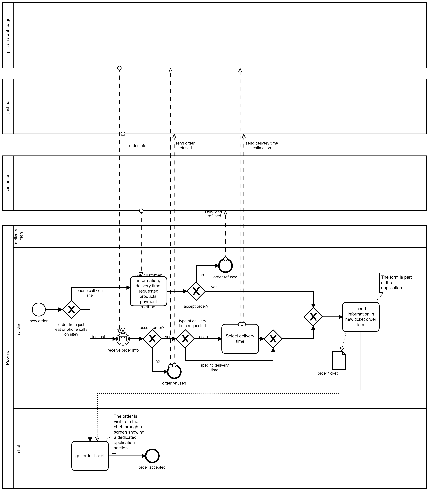

Model of Organization: To Be

# Summary of changes

Here describe at high level the change(s), and their motivation. Link with critical points identified in As Is analysis

**To contrast order loss and mischeduling of orders**
A web app will be developed to automatize and reduce human errors in the following events:
- A section of the web applications will be used by the pizza chef to signal the status empty/low/medium/full of the ingredients, this will be useful for:
  - Giving the cashier the ability to register only orders that can be satisfied reaching an agreement with the client at ordering time.
  - Automatically create a shopping list for the restock. 
- Orders will be registered by the cashier in the system with a dedicated form instead of writing the infos by hand on paper post-its.
- Registered orders will be visible by the pizza chef in the kitchen and automatically scheduled by the system 
- Orders information will be visible by the deliverers in a dedicated page of the webapp through their smartphones.
- Register customer to get customer informations only once in order to:
  - build loyalty of the customer by offering loyalty prizes.
  - speed up ordering process

# Organizational variables

Keep this section and subsections, if there is no change just write 'no change'.  In case there is a change detail it.

## Size
'no change'

## Products services
'no change'
## Goal, goal type, vision, mission, strategy
'no change'
## Culture
- "striving for customer satisfaction"
- "efficiency good lmao"
## Structure
'no change'
### IT office
Outsourced management of the application and technical assistance by IT consultancy company
## Formalization specialization centralization
'no change'
## Organizational type
'no change'
# Business model canvas

if there is no change just write 'no change'

other wise detail only the box(es) that change

**Key Partnership:**
- Added to the key partners the consultancy company that produces and maintain the web app

**Cost structure**
- Added to the cost structue the maintenance of the web app

**Key Resources**
- Added to the Key Resources the web app

# IS Views

## Functional view, data

Ticket order now have an additional field: customer number

@TODO: review this, is it necessary?  
Product has another link for substitue product chosen by the customer

Quantity in Ingredient (empty low  medium full)

## Functional view, processes

Write no change if the model remains as in As Is

### Process selection

Report the PICK chart (see process redesign chapter)  used to select the process to be changed and argument about it

#### Inventory restock

#### Get new order

#### Queue management

#### Prepare order

#### Delivery

For each changed process report the new BPMN (highlight where are the changes and why) and  the software functions needed by the IS, as follows

| Activity in BPMN | Supporting Software functions |
| --- | --- |
|   |   |
|   |   |

## IT view

### Application portfolio

Write no change if the portfolio remains as in As Is

Otherwise list here the new portfolio, highlighting new applications, and abandoned applications

#### Selection

Describe the applications considered for the selection

| Application name | Vendor | Description | Price model and fees |
| --- | --- | --- | --- |
|   |   |   |   |

Describe here how the selection of the new application was made

| Criterion | Application1 | Application2 | Application x |
| --- | --- | --- | --- |
|   |   |   |   |

Alternatively argue that the new application should be developed custom for the company.

#### Coverage

Show how the selected application provides the software functions needed (as identified in Functional view, processes section), discuss gaps, if any

| Software function needed (from process view) | Software function provided by application selected | Gap analysis |
| --- | --- | --- |
|   |   |   |

### Technological view

Write no change in case. Otherwise report the new deployment diagram and highlight the changes

#### Integration

In case a new application is introduced discuss how integration happens in terms of

Data exchange (which data is exchanged)

Control mechanism (mechanism used by applications to interact, ex message passing, rpc, etc)

# IT strategy

Discuss if there should be changes to it.

# Effect of change(s)

## Effect on KPIs and CSFs

(remark, KPIs and CSFs should not depend on the change, but should remain the ones defined in the As Is section � the goal being to compare the effect of the change on the same indicators)

Report only indicators that are supposed to change, argument on why the change has an effect on them, report how much the indicator could change. Do not forget the unit cost of the product / service.

| Indicator (Csf, Kpi) name | Effect | Quantitative estimate of variation (absolute, %) |
| --- | --- | --- |
|   |   |   |

## TCO, ROI and Break even

Define the TCO for the change (use a 3 -5 years horizon)

Estimate costs (from TCO) and savings, and discuss the number of years needed to recover the investment

## Risks

Discuss the main risks (technological, organizational, human factors) related to the change, and what can be done to reduce them

# Conclusion

In summary, why the organization should buy (and pay for) your proposal of change?